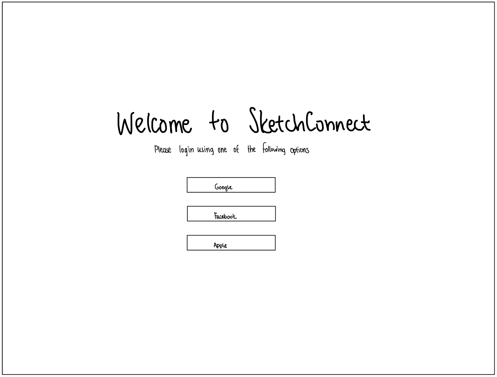
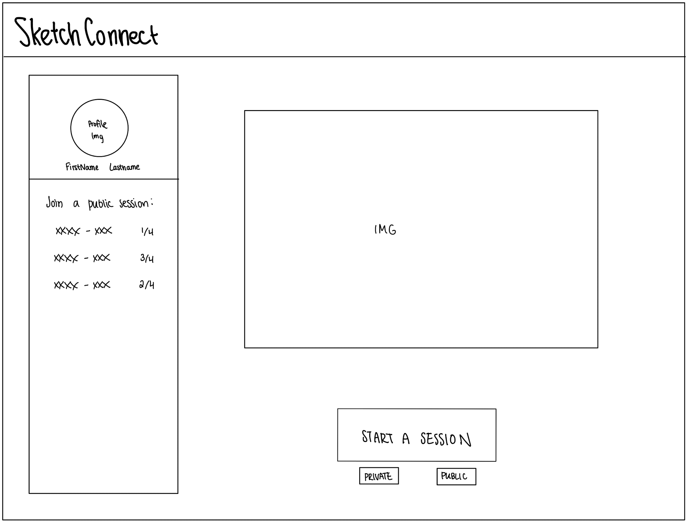
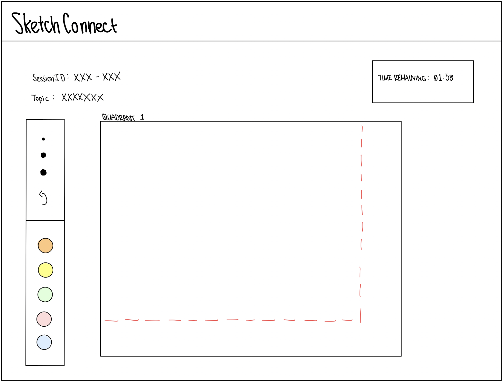
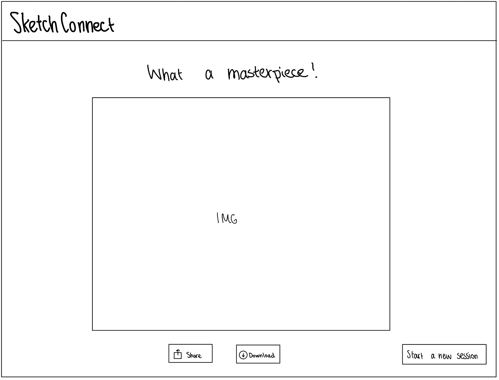

# SketchConnect

A collaborative 4 player doodling game.  

<!-- TABLE OF CONTENTS -->
## Table of Contents

* [Project Description](#project-description)
* [Project task requirements](#project-task-requirements)
* [Task breakdown](#task-breakdown)
* [Prototypes](#prototypes)

## Project Description

**1. Who is it for?**

SketchConnect is designed for groups of four friends or family members, or really, anyone who enjoys doodling.

**2. What will it do?**

Players will sequentially draw in their assigned sections of a 2x2 grid, with only the slight glimpse of the bordering segments' drawings visible. Once everyone has finished, the four sections merge, revealing the collective masterpiece!

**3. What type of data will it store?**

Each SketchConnect session will be stored as a distinct record in our database. A single session (or game) will house up to the information of four logged-in users, their respective drawings, and the final combined artwork.

**4. What will users be able to do with this data?**

The unique session IDs will be utilized to generate invite links for users to join a SketchConnect game. Upon the creation of the final combined artwork, users can laugh at and share their final drawing.

**5. What is some additional functionality you can add or remove based on time constraints?**

We have numerous ideas for enhancing the game experience, such as:
- Additional customization features for the drawing experience (e.g., brush colors, brush thickness, clear drawing, etc.)
- A timer to indicate the remaining drawing time for each player
- Options for public or private game rooms
- In-game group chats for player communication
- Additional game modes (e.g., 3x3 grid, collaborative drawing modes, etc.)

## Project task requirements

#### Minimum Requirements
- A canvas to doodle individually prompted and combined at the end
- Making it collaborative with 4 players
- Creating and storing a session
- Storing the images
- Getting Canvas image data and store it, stitch it together then store and display final image

#### “Standard” Requirements
- Guidelines for other person to continue from and they see a bit of what the other person has drawn
- Downloadable PNG File
- Share Via Social Media
- Default Timer to complete Design

#### Stretch Requirements
- More drawing options such as brush color, width, fill, clear screen, and more
- Oauth (Google / Apple / Facebook) Login
- Public / Private session rooms
- Group Chat to communicate with other players in-game
- Configurable Timer / Game Settings
- Players completed can watch what the other player is doing

## Task breakdown
#### A canvas to doodle individually prompted and combined at the end :
- Create a basic a frontend interface 
- Have the pages setup for the correct control flow for the user
- Create HTML5 Canvas and make it interactive for the user on the right page
- Fetch data from HTML 5 Canvas
- Store Data from HTML 5 Canvas

#### Creating and storing a session
- Create individual sections as records in the database. In each record, have fields for all the necessary information (user ids, session id, individual canvases, etc.)
- Create a mechanism to generate new session ids for new games
- Create dynamic links for players to join a session given a unique url

## Prototypes

