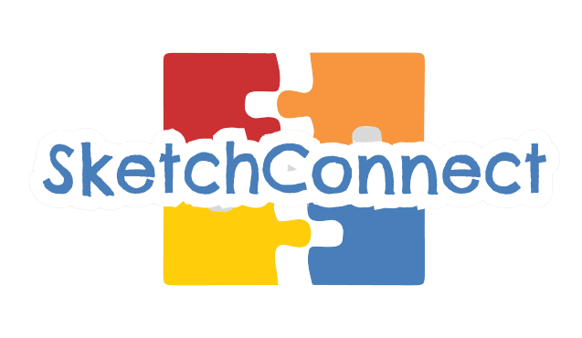
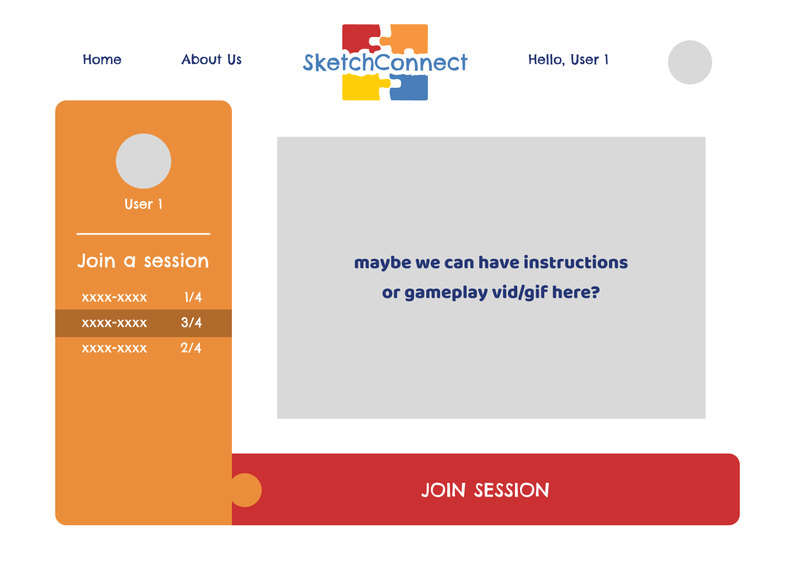
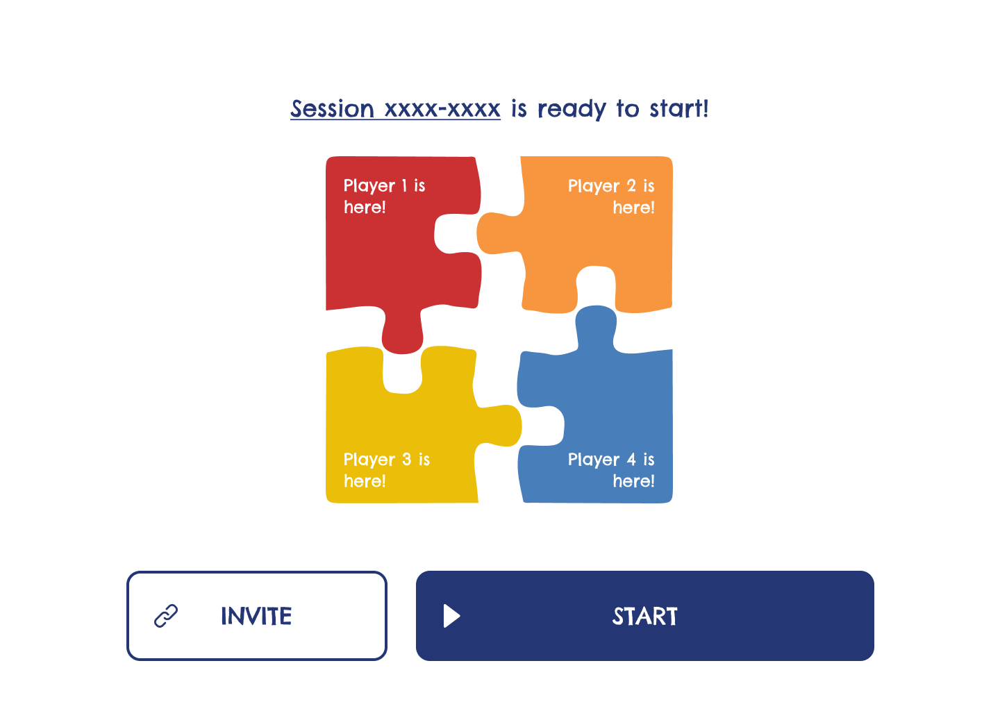
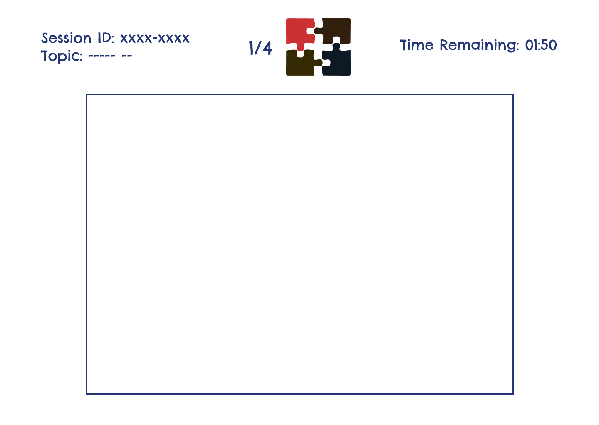
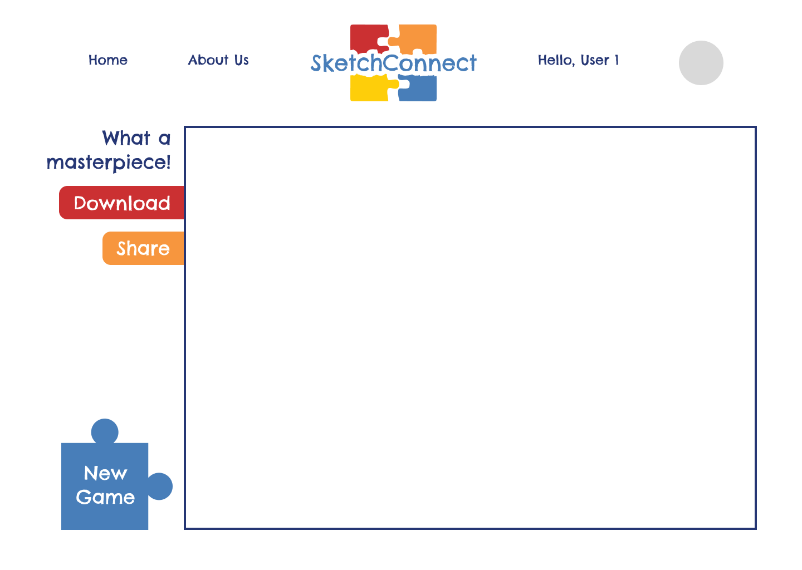

# SketchConnect 

Welcome to 'SketchConnect,' the ultimate collaborative doodling game for 4 players. Assigned to unique quadrants, each participant takes turns drawing, only seeing a subset of previous players' work on their aligned edges. Witness the magic of creativity and diversity as the quadrants unite, creating a mesmerizing and (potentially) seamless masterpiece. 


<!-- TABLE OF CONTENTS -->

## Table of Contents

-   [Project Task Goals](#project-task-goals)
-   [Course Technology Utilized](#course-technology-utilized)
-   [Above and Beyond](#above-and-beyond)
-   [Next Steps](#next-steps)
-   [License](#open-source-license)
-   [Developed By](#developed-by)
-   [Pull Requests](#pull-requests)
-   [Prototypes](#prototypes)

## Project Task Goals

#### Minimum Requirements

- [x] Creating and storing a session for each game started
- [x] Making it collaborative for 4 players
- [x] A canvas representing a quadrant for each player's individual drawing
- [x] Getting HTML5 Canvas drawing data and storing the images
- [x] Connecting the 4 canvases into a 2x2 grid to form the final image

#### “Standard” Requirements
- [x] Guidelines for subset of previous player's drawings on current player's aligned edges
- [x] Downloadable PNG file of final image
- [x] Option to share final image via social media
- [x] Default timer to complete design
- [x] A randomized drawing prompt per game
- [x] Generate session invite link for other players to join

#### Stretch Requirements
- [x] Additional drawing options such as pen variety, stroke width, colours, etc.
- [x] Oauth (Google) Login
- [x] Hall of Fame on user dashboard displaying final drawings from previous games
- [ ] Public / Private session rooms
- [ ] Group Chat to communicate with other players in-game
- [ ] Configurable Timer / Game Settings
- [ ] Players completed can watch what the other player is doing

## Course Technology Utilized
#### Unit 1: HTML, CSS, JS
Our application's web pages are structured using HTML, and styled with CSS. The core logic for handling dynamic interactions and client-side functionality was implemented using JavaScript to create an interactive user experience.
#### Unit 2: React & Redux
We used React to build the frontend of SketchConnect, it allowed us to use a component-based architecture to build our interface quickly and reuse UI elements. We used Redux for state management as it provides a single source of truth for the application's state, enabling seamless data sharing among components.
#### Unit 3: Node & Express
Node.js and Express were use to set up and run the server, facilitating smooth communication between our frontend and backend services. We used Express to create REST APIs, handle HTTP requests, and communicate with external services like our MongoDB database and Google Cloud Storage bucket.
#### Unit 4: MongoDB
We used MongoDB to efficiently store, retrieve, and modify user and game session data, ensuring data persistence even when the application is closed. With its JSON-like format, it integrated seamlessly with our Javascript-based tech stack.
#### Unit 5: Builds & Deployment
SketchConnect's frontend was deployed on Vercel, a platform known for its great developer experience and fast performance. Vercel allowed us to preview changes in our PRs before we merged our code to main, which made it much easier for us to review eacg others' PRs. We deployed our server on Render, since it provided a seamless experience and generous free tier.

## Above and Beyond
#### <span>Socket.IO</span> & Change Streams 
Since a major aspect of SketchConnect is the multiplayer experience, we had to ensure that our real-time data flow was efficient. To accomplish this, we used Socket.IO (a popular websocket library) to handle communication between multiple clients and the server, and MongoDB's change streams to monitor and report live changes in our database. Whenever a monitored database field is changed, the server sends a message to all the clients in the room, letting them know that the relevant data has been updated and that it's time to carry out a specific action. For instance, when a player joins a game's waiting room, the server will send a message to all the players, and the clients will refresh the number of puzzle pieces shown in the waiting page, signifying that a new user has joined the game. Compared to polling the server for changes, websockets provide a more efficient and responsive means of real-time communication, allowing for immediate updates without the overhead of repeated HTTP requests, thus greatly enhancing the performance and user experience.

#### Image Storage
To ensure future scalability, SketchConnect strategically stores all user drawings in Google Cloud Storage buckets rather than storing the images directly in MongoDB. Whenever a user completes a drawing in their quadrant and when a session's final image is created, the images are immediately uploaded to designated storage buckets. By storing a URL reference to each drawing within MongoDB, we effectively offload the burden of managing binary data from the database. This approach not only optimizes performance by reducing the database's load every time we fetch a session, but also allows for more cost-effective scaling in the future, since cloud storage solutions are specifically designed to handle large amounts of unstructured data.

#### Sharing via Social Media
SketchConnect integrates with social media platforms, empowering players to share their team's final masterpieces directly from the game interface while also sharing our app with larger demographics. We used the `react-share` library to smoothly redirect to platforms like Twitter and Pinterest, elevating the user experience by fostering a sense of accomplishment and enhancing engagement through encouraging teams to showcase their creativity with a wider audience.

#### Research-driven UX
In shaping SketchConnect, we prioritized a user-centric approach through conducting thorough UX research and testing with over 30 users. By understanding player preferences (style of online games played, prompts, timer configurations, etc.) we ensured an interface that would be fun, friendly, seamless and intuitive for a delightful collaborative online doodling experience.

#### Authentication
To safeguard user data and maintain a secure environment, the app implements Firebase authentication, providing a hassle-free login and registration process. By allowing players to create accounts, we are also able to maintain a history of every player's past drawings, which they can revisit at any time in the future by heading to their dashboard.

## Next Steps
The next steps to improve the app include adding public/private session rooms for more versatile gameplay, implementing a group chat feature for real-time communication, and introducing configurable timer and game settings to cater to different player preferences. Additionally, enabling a spectator mode will allow completed players to watch others in real time, enhancing the overall gaming experience.

## Open Source License

```
Copyright (C) 2023 Martin Cai, Michelle Kim, Michelle Wang, Shu Ting Hu, Vishal Desh

This program is free software: you can redistribute it and/or modify
it under the terms of the GNU General Public License as published by
the Free Software Foundation, either version 3 of the License, or
(at your option) any later version.

This program is distributed in the hope that it will be useful,
but WITHOUT ANY WARRANTY; without even the implied warranty of
MERCHANTABILITY or FITNESS FOR A PARTICULAR PURPOSE.  See the
GNU General Public License for more details.

You should have received a copy of the GNU General Public License
along with this program.  If not, see <http://www.gnu.org/licenses/>.
```

## Developed By
<!-- TODO: List of contributions. Highlight areas where each team member contributed significantly. [2-3 sentences per team member] -->
-   [Martin Cai](https://github.com/martincai8)
    - Leveraged Socket.IO to facilitate real-time data broadcasting between clients and the server, enabling seamless interaction as players took turns drawing in their individual quadrants, thus enhancing the user experience.
    - Designed a dedicated service for handling image uploads by utilizing Google Cloud Storage buckets. Integrated MongoDB to store URLs of the corresponding resources, thereby enhancing scalability, security, and streamlining the retrieval process.
    - Implemented protected routes within the application, enforcing stringent access control. This strategy ensured that only authenticated users could access certain features, reinforcing overall security.
-   [Michelle Kim](https://github.com/michelleykim)
    - Orchestrated the development of the application's user interface, leveraging an iterative user research combining user research insights for an intuitive, inclusive user experience.
    - Employed the Redux Thunks to seamlessly integrate backend API invocations within the frontend framework, thereby ensuring efficient and synchronous data exchanges.
    - Elevated the overall game flow by introducing a functionality that enables players to access a section of previous participants' drawings, fostering continuity and engagement. Additionally, combined individual player drawings into a cohesive composition upon completion of the gaming experience.
-   [Michelle Wang](https://github.com/michelle-wangg)
    - Implemented user authentication using Firebase, ensuring both convenience and security in a streamlined sign-in experience, and storing user information in the database for profile-dependent functionalities.
    - Worked on the User Dashboard, creating endpoints to add session details to users, allowing for the display of completed images in the Hall of Fame.
    - Help define user and session schema, added topics to the game page and updated the Mongo database to reflect these changes.
-   [Shu Ting Hu](https://github.com/shuting-hu)
    - Utilized Redux to facilitate fluid client-server API communication, enhancing state management for user and session actions.
    - Streamlined the game flow by implementing session start, turn-based navigation, dynamic game lobby / drawing page components, and introduced loading states to facilitate smooth transitions.
    - Employed the react-share library to seamlessly integrate social media platforms, providing direct sharing functionality of their final combined creation, encouraging game engagement and team accomplishment.
-   [Vishal Desh](https://github.com/VDeshh)
    - Created HTML 5 Canvas in react scaled according to the device's pixel ratio and added several state variables to handle different functionalities such as brush color, size, erasing, and exporting.
    - Development of the frontend User interface and assisted in design
    - Worked on overlapping the images initially by stripping the images from the bucket and overlaying it on canvas which was then changed by the team to render outside the canvas boundaries.
    - Made API calls from individual quadrants to store into google cloud bucket and fetched from the same for image stripping.
    - Assisted in writing redux calls for adding session to player object in the front end.
    - Added Styling and coordinate mapping for canvas.

## Pull Requests

1. Just fork a version of this repository, make the changes you want to, and make a pull request.
2. We will review the pull request, and accept or reject any incoming changes after testing.

<!-- further materials (from initial) can remove or keep -->

## Prototypes





